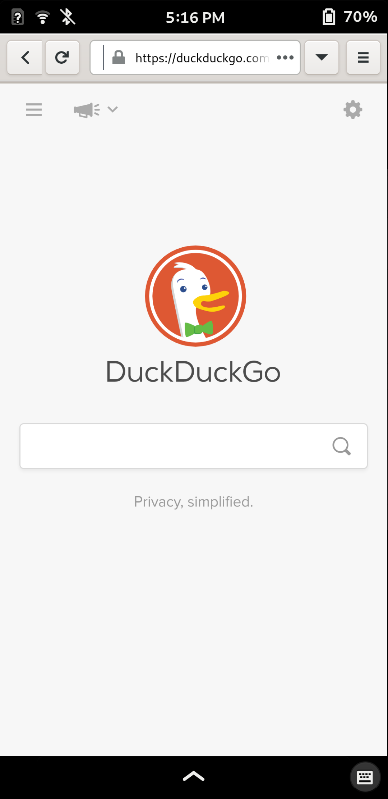
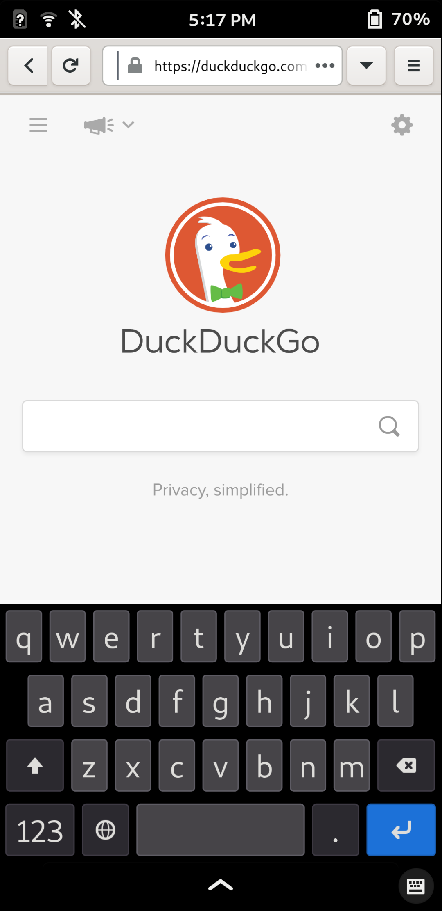

<h1 align="center">
	<br>
 Firefox GNOME theme
</h1>

<p align="center"><strong>A Firefox theme for Phosh</strong></p>

<p align="center">This theme follows lastest GNOME Adwaita style.</p>

<p align="center"> </p>

## Description

This is a fork of Firefox GNOME Theme.
https://github.com/rafaelmardojai/firefox-gnome-theme


## Installation

### Installation script
1. Clone this repo and enter folder:
	
	```sh
	git clone https://github.com/giovannicaligaris/firefox-phosh-theme && cd firefox-phosh-theme
	```
2. Run installation script

	#### Auto install script
	
	This script will lookup Firefox profiles location and enable a theme variant for your GTK theme if it exists.
	```sh
	./scripts/auto-install.sh
	```
	#### Install script
	```sh
	./scripts/install.sh # Standard
	./scripts/install.sh -f ~/.var/app/org.mozilla.firefox/.mozilla/firefox # Flatpak
	```

### One command curled script

You can also install this theme with one command:

```sh
curl -s -o- https://raw.githubusercontent.com/giovannicaligaris/firefox-phosh-theme/master/scripts/install-by-curl.sh | bash
```

It will download the latest version of the theme and run the auto installation script for you.

### Extensions recommended

Download the following Addons and enable them:

<p>Mobile View Switcher: https://addons.mozilla.org/en-US/firefox/addon/mobile-view-switcher/
<br>Pull to Refresh: https://addons.mozilla.org/en-US/firefox/addon/pull-to-refresh-for-browsers/
<br>Load Progress Bar: https://addons.mozilla.org/en-US/firefox/addon/load-progress-bar/
<br>Hide-scrollbars: https://addons.mozilla.org/en-US/firefox/addon/hide-scrollbars/</p>
